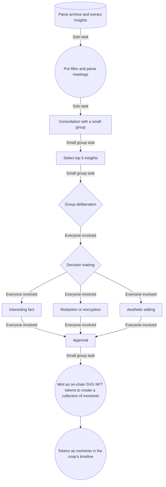

# Parsing and Minting Insights from Meeting Notes

## Objective
This project is a creative exploration of generative decision processes.
 
Through deliberation and collective decision-making, we will be bringing visual representation of these insights as on-chain NFT tokens. The sum of these tokens will represent a co-created visual timeline of Hypha.

## Overview

## Process

1. **Parse Archive and Extract Insights**
   - **Goal:** Gather as many insights as possible from the meeting notes.
   - **Examples of Insights:**
     - Number of consecutive monthly all-hands meetings.
     - Longest meeting in character count.
     - Number of projects in project updates.
     - Notable moments and fun facts.

2. **Pre-filter and Parse Meetings**
   - **Task:** Review meeting notes to extract and pre-filter insights.
   - **Criteria:** Ensure insights are significant and relevant to the cooperative.

3. **Consultation with a Small Group**
   - **Objective:** Present the pre-filtered insights to a small group for initial review.
   - **Task:** Select the top 5 insights based on their relevance and interest.

4. **Group Deliberation**
   - **Participants:** Entire cooperative or a designated decision-making body.
   - **Discussion Points:**
     - Is the insight an interesting fact about the coop?
     - Does the insight need redaction or encryption (e.g., obfuscation of private data via hashing)?
     - Should the insight be edited or altered aesthetically?

5. **Approval Process**
   - **Outcome:** Reach a consensus on whether the insight should be approved, redacted, encrypted, or edited.
   - **Documentation:** Record the decisions and rationale for transparency.

6. **Minting as On-Chain SVG NFT Tokens**
   - **Task:** Mint approved insights as on-chain SVG NFT tokens.
   - **Goal:** Preserve important milestones and notable moments as digital artifacts.

## Benefits
- **Transparency:** Deciding on the level of transparency for each insight.
- **Historical Record:** Minting important milestones as NFTs to create a digital archive.
- **Collaborative Decision-Making:** Testing and refining generative decision processes within the cooperative.

## Conclusion
This low-stakes exercise will help us test out generative decision processes and provide ideas on how to better work together. It also offers an opportunity to preserve and celebrate our cooperative's history through the minting of digital artifacts.